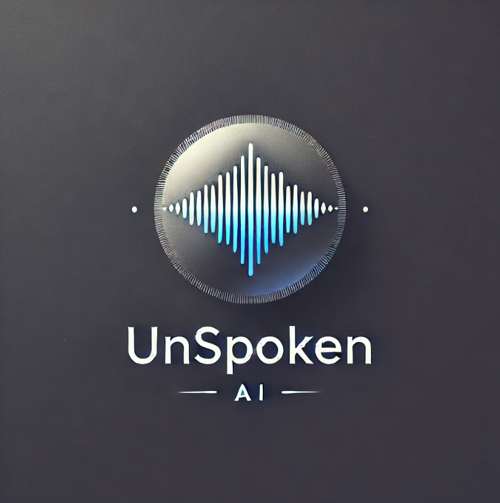

# **Unspoken AI - Healing memories** 

What if you could have that one conversation you never had time to have?

Sometimes, the one conversation you never had… is the one thing that could help you to heal.

## **Demo** 

[](https://www.youtube.com/watch?v=voGeC3ooCmo)

## **Inspiration**  
What if you could have a conversation you never had time for? What if you could hear the voice of someone you lost—one more time? Millions of people use ancestry sites to learn about their family history, but voices, emotions, and real conversations are lost forever.  

We built **Unspoken AI** to help people reconnect with their past. This project is about **keeping memories alive, preserving family history, and offering closure through AI-driven conversations.**  

## **How We Built It**  
We combined advanced AI technologies to create **real-time, personalized voice conversations** with historical figures and loved ones.  

- **ElevenLabs Voice Cloning** to bring back authentic voices  
- **OpenAI for Dynamic Conversations** to make interactions personal and natural  
- **User-Provided Data** including letters, diaries, and voice samples to build a realistic persona  
- **Dynamic Prompt Generation** to create meaningful conversations based on user input  
- **Next.js & Vercel** for a smooth and fast user experience  
- **Supabase & PostHog** for data storage and analytics  

## **Challenges We Faced**  
Bringing voices back to life was both a technical and emotional challenge. Some of the biggest obstacles were:  

- **Creating natural voices** that sound real and familiar  
- **Making AI responses feel human** instead of robotic  
- **Balancing accuracy and emotion** while keeping conversations meaningful  

## **What We Learned**  
- **Memory is more than words** – People want more than just a voice. They want connection.  
- **AI can be used for healing** – It can help people **preserve legacies, find closure, and relive history.**  

## **The Future of Unspoken AI**  
This is just the beginning. In the future, we see Unspoken AI integrated with **family history platforms, historical archives, and even VR experiences.** A world where history does not just live in books—but speaks to you.  

We built this in just **one day.**  
**Imagine what we can do next.**  

**Unspoken AI – Because voices never truly fade.**

## Setup

Set up the environment variables:

```bash
cp .env.example .env
```

Follow [this guide](https://elevenlabs.io/docs/conversational-ai/docs/agent-setup) to configure your agent and get your API key and set them in the `.env` file.

Run the development server:

```bash
npm run dev
# or
yarn dev
# or
pnpm dev
# or
bun dev
```


## Docker

```bash
i=node:hydrogen-alpine3.21
docker pull $i
docker run -v $PWD:/app -it --rm $i sh
cd /app
npm i
npm run dev
# npm run build
# - Network: <IP>
```

## Technologies used

- ElevenLabs (Conversational AI, Voice Cloning)
- Next.js
- Vercel
- Supabase
- OpenAI
- Tailwind CSS
- PostHog
- fal.ai for shots of demo

## Learn More

- [Conversational AI Tutorial](https://elevenlabs.io/docs/product/introduction)
- [Conversational AI SDK](https://elevenlabs.io/docs/libraries/conversational-ai-sdk-js)
